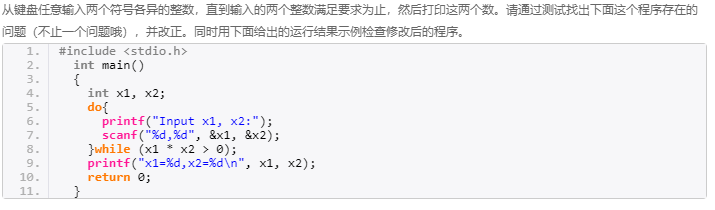

# 慕课试题分析
## 回文数或者字符模块
思想：回文数的判定为重新计算这个数，回文字符的判断只需一个循环判断每个字符是否相等就可以了
 <!--more--> 
## 程序改错
```bash
常见类型：
1.没有初始化为0
2.字符串链接最后一个字符要赋值为'\0'
3.二维数组的变换行i要乘的数是创建二维数组的列或者行的长度
4.内存没有分配
```
## 一些例题
### 例题：求正负余数
思想：负余数加上除数然后再求余得到正余数
### 例题：计算时间差
思想：采用结构体的形式，若第一个小时小于第二个则交换然后再做差值计算，分钟不够记得向小时借位，或者全部转换成分钟进行相减，然后取绝对值，最后再化成小时分钟形式
``` bash
格式显示问题，在%-09d 的意思是左对齐然后不够的数补零（一般带左对齐不用补零），同理可知右对齐
```
### 例题：出租车计价
思想：停车时间需要判断是否可以被5除，如果可以则不用再除以5之后加一，路程要进行判断不满一公里向前进位，所以要加一
### 例题：猜年龄
问题：年龄的立方是个四位数而四次方是一个六位数，且每一个位都不一样
思想：存储数组判断十个数都不相同，也就相当于每一位都不等于0，设置find变量进行判断
### 例题：计算心跳数
问题：从出生到现在的总共的心跳数
思想：sum+=(count-1+365*(year-birth))*24*60*75;
关键：在于得到的count为闰年数，如果今年也是闰年的话则需要减去1否则不用
### 程序改错1

关键：容易陷入到只是判断scanf的正确对入的个数的问题，因为字符在c中被当作ASCII计算，所以应该设置多判断形式。
```bash
res =scanf("%d,%d", &x1, &x2);
        switch(res)
        {
        case 0:
            while(getchar()!='\n');//读取缓冲区的所有内容，防止下次循环的错误输入
            flag =1;
            break;
        case 1:
            while(getchar()!='\n');
            flag =1;
            break;
        case 2:
            if(x1*x2>=0)
            {
                flag=1;
                break;
            }
            else
            {
                flag =0;
                break;
            }
        }
```
### 程序改错2
```bash
    char   *pStr[M];
    printf("How many countries?\n");
    scanf("%d",&n);
    getchar();        /* 读走输入缓冲区中的回车符 */
    for(i=0; i<n; i++)
    {
        pStr[i] = (char *) malloc(sizeof(char)*N);//动态分配内存
    }
    //直接初始化char* month[13] ={"","","","","","","","","","",""};//这里的初始化是对指针的地址初始化
```
### 例题：金字塔图案打印
思想：关键设置两个变量，一个是res表示的与字符A之间的距离，表示空格打印个数以及总打印行数，然后是设置基础字符A循环打印
```bash
    int res= a-'A'+1;
    char jishu;
    jishu = 'A';
    while(i<res)
    {
        for(j=i; j<res; j++)
        {
            printf(" ");
        }
        for(k=0; k<=i; k++)
        {
            printf("%c",jishu+k);
        }
        for(k=i-1;k>=0;k--)
        {
           printf("%c",jishu+k);
        }
        printf("\n");
        i++;
    }
```
相似例题：打印减序的类似金字塔
```bash
    do
    {
        for(j=res;j>=res-i;j--)
        {
            printf("%c" ,jichu+j-1);
        }
        i++;
        printf("\n");
    }while(i<res);
```
### 例题：计算sinx
思想：通过前一项计算后一项，关键点在一定要使用double类型的变量计算阶乘
```bash
    do
    {
        sigh = -sigh;
        res =ss*sigh/Fact(2*i-1);
        sum+=res;
        ss=ss*x*x;
        i++;
        count++;
    }  while(fabs(res)>=1e-5);
```
### 例题：水手分椰子
思想：最后留下一个所以最后一次分的时候一定是modn为1的，判定能否整除的方式有两种，一个是强制类型转换为int判断，或者直接设置成判断能整除才可以整除
```bash
    do
    {
        res=res*(n)/(n-1)+1;
        i++;
        if(res!=(int)res)
        {
            i=1;
            x++;
            res=n*x+1;
        }
    }while(i<n);
```
### 例题：好数对
问题：一个集合当中的数任意两个不同的数相加的和也在集合当
思想：三层循环
### 例题：计算工作还是休息
思想：计算总的日子，然后对5取模
### 例题：统计用户输入
思想：不一定非要用字符串来统计用户的输入的字符，可以直接一个循环单个字符读入判断
```bash
do
    {
        ch =getchar() ;
        if(ch==' ')
        {
            space++;
        }else if(ch =='\n')
        {
            newline ++;
        }else if(ch!='#')
        {
            others++;
        }
    }while(ch!='#');
```
### 例题：幻方矩阵**
问题：每一行每一列对角线的和都是相同的
```bash
for(i=0;i<5;i++)
    {
        for(j=0;j<5;j++)
        {
            sum[5+j]+=a[i][j];//记录每一列
            sum[i] +=a[i][j];//记录每一行
            if(i==j)
            {
                dui1+=a[i][j];
            }
            if(i+j==4)
            {
                dui2+=a[i][j];
            }
        }
    }
```
### 例题：寻找鞍点
问题：矩阵中莫一行的最大值以及莫一列的最小值
思想：保存每一行每一列的最大值最小值，然后在比较是否有相同的数有则输出即可

### 例题：蛇形矩阵
思想：分成两段来打印，一段打印左上角包括对角线，一段打印右下角
```bash
 while(i<n &&j<n)//最终这个循环会把左上角打印，结束的时候ij都为是n
    {
        if(i==0)
        {
            j++;//向右平移一个单位打印
            a[i][j]=++count;
            while(j>0)//结束的条件j会等于0
            {
                j--;
                i++;//向左下方移动
                a[i][j]=++count;
            }
        }
        if(j==0)
        {
            i++;//向下平移一个单位打印
            a[i][j]=++count;
            while(i>0)//结束的时候i会等于0
            {
                i--;//向右上方平移
                j++;
                a[i][j]=++count;
            }
        }
    }
    i=n-1;
    j=n-1;
    a[i][j]=s;
    while(i>1 &&j>1)//这里不是大于0而是大于1是因为不用重复打印对角线
    {
        if(i==n-1)
        {
            j--;//在最后一行向左边移动
            a[i][j]=--s;
            while(j<n-1)//结束的时候j移动到最后一列
            {
                j++;//向右上方移动
                i--;
                a[i][j]=--s;
            }
        }
        if(j==n-1)
        {
            i--;//在最后一列向上移动
            a[i][j]=--s;
            while(i<n-1)//结束的时候i移动到最后一行
            {
                i++;//向左下方移动
                j--;
                a[i][j]=--s;
            }
        }
    }
```
### 例题：亲密数
思想：计算一个范围内的亲密数的多少，可以用两次函数亲密数的亲密数还是自己来判断
```bash
 for(i=1;i<n;i++)
    {
        int res=Judge(i);
        int res2= Judge(res);
        if(i==res2 &&res2<res)
        {
            printf( "(%d,%d)\n",i,res);
        }
    }
```

### 例题：梅森尼数
问题：形如2^i-1的素数
思想：数据过大，应该用double类型存储并且判断方式发生改变
```bash
for(i=2;i<=sqrt(n);i++)
    {
        if(n/i == (int)(n/i))
        {
            return 0;
        }
    }
```
### 例题：查找子串
**经典思想：先判断找到第一个字符，然后一次循环找到后面的所有的字符一旦有一个不满则find置为0**
```bash
 for(i=0;i<len1;i++)
    {
        if(s[i] ==d[0])
        {
            find=1;
            for(j=1;j<len2;j++)
            {
                if(s[i+j] !=d[j])
                {
                    find=0;
                }
            }
            if(find)
            {
                return i+1;
            }
        }
    }
```
### 例题：统计重复字符串
**思想：在一个函数中需要改变两个变量，不妨设置参数为指针类型**
```bash
for(i=0;i<len1-1;i++)
    {
        if(str[i]==str[i+1])
        {
            count++;
            if(max<count)
            {
                max = count;
                *tag =i;
            }
        }
        else
        {
            count=1;
        }
    }
```
### 例题：出售金鱼
**思想：上题的找到第一个符合的设置find变量方法**
```bash
  do
    {
        sum++;
        i=1;
        reminder=sum;
        if((i*reminder-1)%(i+1)==0)
        {
            find=1;
            reminder = (i*reminder-1)/(i+1);
            for(j=2;j<=4;j++)
            {
                if ( (j*reminder-1)%(j+1)!=0)
                {
                    find=0;
                    break;
                }else
                {
                    reminder=(j*reminder-1)/(j+1);
                }
            }
        }
    }
    while(find==0 || reminder!=11 );//这里的判定条件是或者关系
```
### 例题：颠倒句子中的单词顺序
思想:把最后一个的标点符号存储起来，然后将一个字符数组按照空格转换到二维数组当中
```bash
 char ch = str1[len-1];
    str1[len-1]='\0';
    int j=0,k=0,i=0;
    for(i=0; str1[i]!='\0'; i++)
    {
        if(str1[i]!=' ')
        {
            str2[j][k]=str1[i];
            k++;
        }
        else
        {
            str2[j][k] = '\0';
            j++;
            k=0;
        }
    }
```
### 例题：奇偶数分离
思想：关键是打印的时候逗号的处理，首先用函数将奇数放在偶数后面然后打印
**或者直接两边遍历打印，第一次打印奇数第二遍打印偶数**
```bash
for(i = 0; i < n; i++)
    {
        if(a[i]%2 == 1)
        {
            if(count == 0)
                printf("%d",a[i]);
            else
                printf(",%d",a[i]);
            count++;
        }
    }
    count = 0;
    printf("\n");
    for(i = 0; i < n; i++)
    {
        if(a[i]%2 == 0)
        {
            if(count == 0)
                printf("%d",a[i]);
            else
                printf(",%d",a[i]);
            count++;
        }
    }
```
### 例题：字符串链接
```bash
  int i = 0,j=0;
    while (*(dest+i)!='\0') 
      i++;//先用一个循环把i放置到第一个字符的最后一个位置
    for (; *(source+j)!='\0'; j++)
    {
        *(dest+i) = *(source+j);
        i++;   
    }
    *(dest+i) = '\0';//关键要给最后一个赋值结束符
    return dest;
```
### 例题：删除字符串中相同的字符
```bash
do{
        if(a[i] ==ch)
        {
            for(j=i;j<len-count;j++)
            {
                a[j] =a[j+1];
            }
            a[j-1] ='\0';
            count++;
            i=-1;
        }
        i++;
    }while(a[i]!='\0');
```
### 例题：最大公约数
问题：从大到小一次返回公约数
```bash
int jishu=1;//通过设置全局变量来统计总共多少次，这是这一题的关键所在
int CommonFactors(int a, int b)
{
    int i;
    int count=0;
    for(i=a; i>=1; i--)
    {
        if(a%i==0&&b%i==0)
        {
            count++;

        }
        if(jishu ==count)
        {
            return i ;
        }
    }
    return -1;
}
```
### 例题：求解不等式
```bash
    do
    {
        res=0;
        for(i=0; i<=m; i++)
        {
            res=res +sqrt(m+i);
        }
        m++;
    }while(res<=n);//记得打印m-1
```