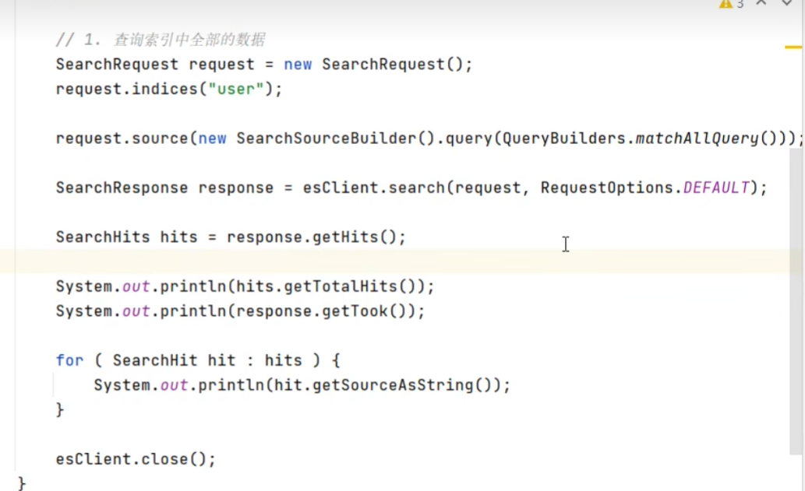
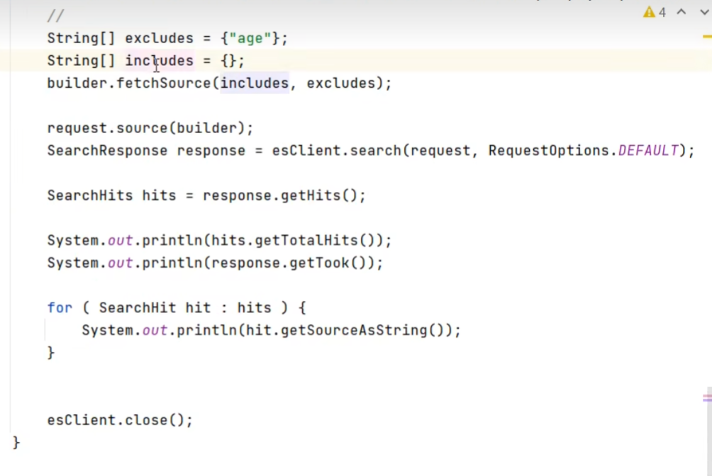
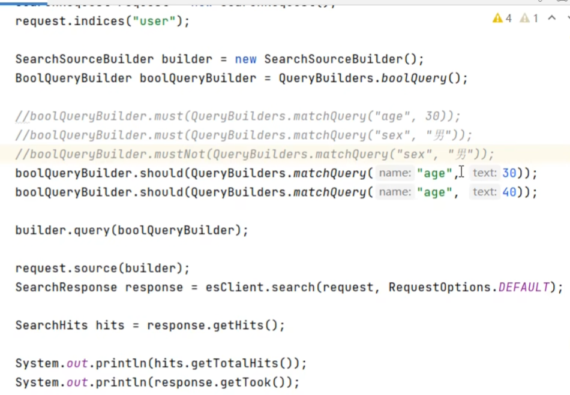
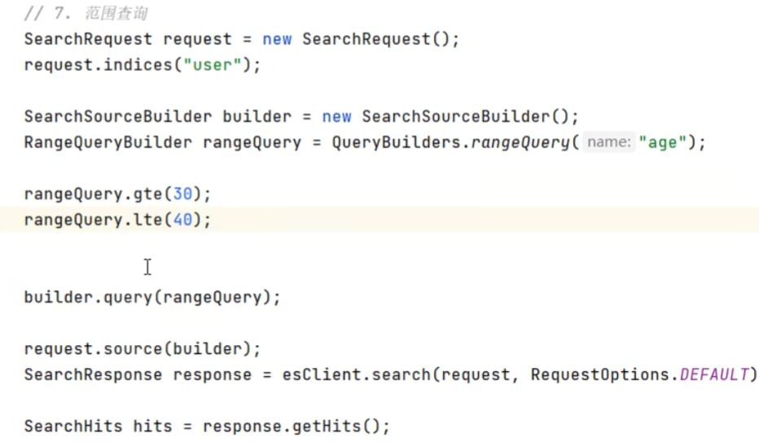
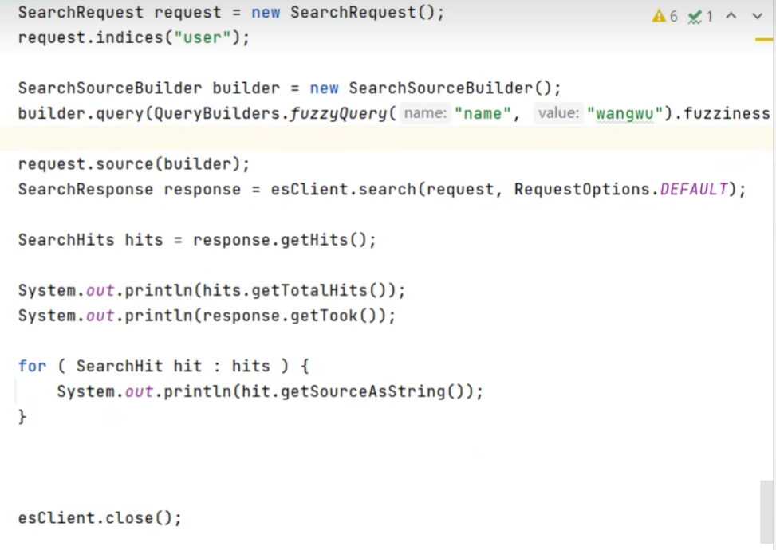
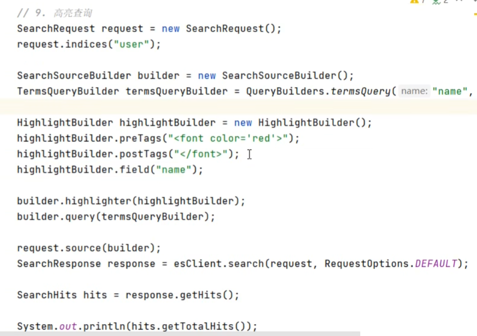
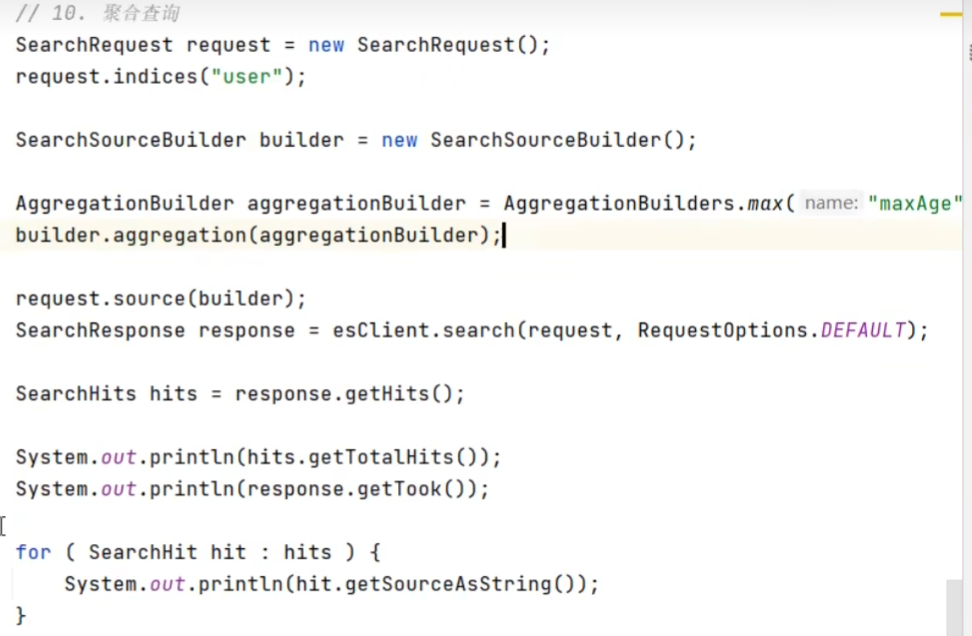
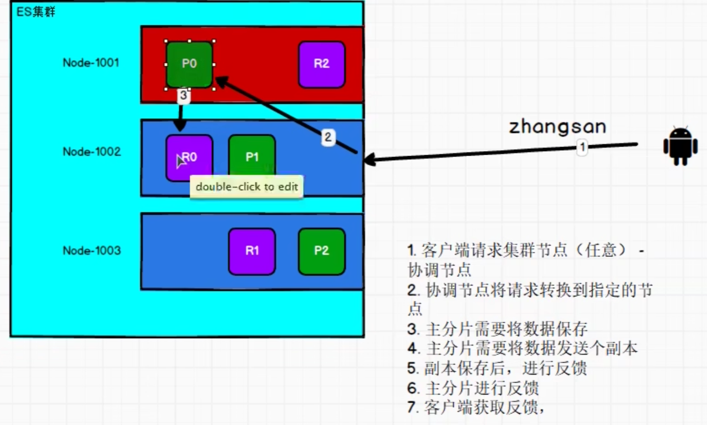
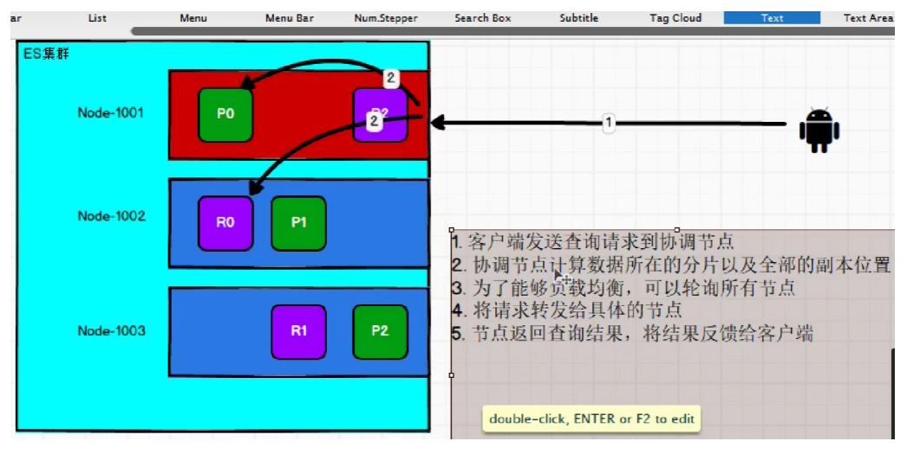
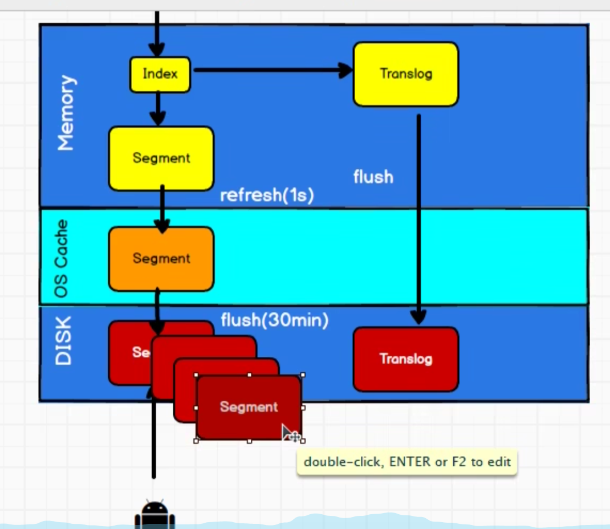

# ES

面向文档的文档型数据库

索引类型文档字段

倒排索引：关键字和文章id关联起来

正向索引  

## 基本操作

索引就是数据库

PUT  ip/shopping，必须是幂等性

得到索引

GET ip/_cat/indices?v

添加文档

POST ip/shopping/_doc/1001

 添加文档 body中添加json文件，不一定是幂等性

得到文档

GET ip/shopping/_doc/1001

GET ip/shopping/_search 所有的数据

修改文档

+ 全量更新，完全覆盖
  + PUT ip/shopping/_doc/1001 body里面是所有的
+ 局部更新
  + POST ip/shopping/_update/1001  body里面不是所有的

删除文档

DELETE ip/shopping/_doc/1001

## 查询

```bash
GET   ip/shopping/_search body里面 写query ,match , match_all ,from ,size, _source 指定查询,sort 
```















分组：AggregationBuilders.terms("名").filed("字段")

## 面试题

### 创建索引的过程，写入数据：

1. 协调节点根据hash找到要写入的主分片，转到指定的节点。
2. 主分片保存
3. 同步到副分片
4. 依次返回


### 搜索的过程：

1. Query then fetch
2. 广播到索引中每一个分片，包括主分片和副本分片，每个分片在本地执行搜索构建一个匹配文档大小的from+size的优先队列
   + 搜索的时候是查询的Filesystem cache 的，但是还有数据在Memory buffer 所以近实时
3. 每个分片返回优先队列给协调节点，协调节点进行全局排序后产生一个结果列表
4. fetch操作。协调向相关的分片提交多个get请求。进入到下面的查询文档的过程

### 查询文档的过程：

1. 发送get查询请求到协调节点
2. 计算数据所在的分片，以及全部的副本位置
3. 轮询所有的节点
4. 请求转发给具体的节点
5. 返回查询结果，结果返回给客户端



### 索引文档的过程，底层

1. 协调节点通过文档id参与计算，得到文档要放在哪个分片中 shard = hash(document_id) % (num_of_primary_shards)
2. 先写到Memory Buffer 以及同时写到 Translog中，然后定时写入到Filesystem Cache 这个过程叫做Refresh 通常一秒一次
3. 通过Translog 保证数据的可靠性，只有 Filesystem Cache  中写到磁盘的时候才会清除掉。flush的时候
4. flush：30分钟或者Translog中的太大，512M的时候。


### 更新和删除文档

1. 更新和删除也都是写操作，但是文档是不可变的，所以不能被删除或者改动展示
2. 磁盘上每个segment都有一个del文件，只是在del文件中标记为删除，在结果中被过滤。
3. 更新：新的文档被创建的时候，指定一个版本号，旧版本的文档在del文件中标记为删除，新版本的索引到一个新段。旧的可以匹配查询，但是结果中被过滤

### 常用请求

```bash

# 查询所有的 不会计算得分
GET _search
{
  "query": {
    "match_all": {}
  }
}
# 或者关系 mill 或者lane 模糊查询 
GET /bank/_search
{
  "query": { "match": { "address": "mill lane" } }
}
# match_phrase 包含两个
GET /bank/_search
{
  "query": { "match_phrase": { "address": "mill lane" } }
}
# bool 组合多个查询条件 
GET /bank/_search
{
  "query": {
    "bool": {
      "must": [
        { "match": { "age": "40" } }
      ],
      "must_not": [
        { "match": { "state": "ID" } }
      ]
    }
  }
}
# 聚合
GET /bank/_search
{
  "size": 0,
  "aggs": {
    "group_by_state": {
      "terms": {
        "field": "state.keyword", # 先按照id进行聚合 
        "order": {
          "average_balance": "desc" # 最后将平均值按照降序排序
        }
      },
      "aggs": {
        "average_balance": { # 聚合成功之后再按照平均值进行聚合  
          "avg": {
            "field": "balance"
          }
        }
      }
    }
  }
}
```

```bash
# should和must在同一层一起使用失效的问题。 最终查询出来的是错误的 并非 sex==男&&(score==70||socre==80)
{
   "query": {
      "bool": {
         "must": [
            {"term": {"sex": {"value": "男"}}} # term是精确查询
         ],
         "should": [
            {"term": { "score": {"value": "70"}}},
            {"term": {"score": {"value": "80"}}}
         ]
      }
   }
}
# 改正：(sex==男&&score==70)||(sex==男&&socre==80)
{
   "query": {
      "bool": {
         "should": [
            {
               "bool": {
                  "must": [
                     {"term": {"sex": "男"}},
                     {"term": {"score": "70"}}
                  ]
               }
            },
            {
               "bool": {
                  "must": [
                     {"term": {"sex": "男"}},
                     {"term": {"score": "80"}}
                  ]
               }
            }
         ]
      }
   }
}
# 改正二：再嵌套一层bool，must和should 在同一层会失效，必须再嵌套一层
{
   "query": {
      "bool": {
         "must": [
            {"term": {"sex": {"value": "男"}}},
            {
                "bool": {
                  "should": [
                     {"term": {"score": {"value": "70"}}},
                     {"term": {"score": {"value": "80"}}}
                  ]
               }
            }
         ]
      }
   }
}
```

### nested

nested类型是**对象数据类型**的专用版本，它允许对象数组以可以彼此独立查询的方式进行索引

基本数据类型

1. Text 支持分词，全文检索,支持模糊、精确查询，**不支持聚合,排序操作**。
   + 存储全文搜索数据, 例如: 邮箱内容、地址、代码块、博客文章内容等
2. KeyWord 不进行分词，直接索引,支持模糊、支持精确匹配，**支持聚合、排序操作**。
   + 存储邮箱号码、url、name、title，手机号码、主机名、状态码、邮政编码、标签、年龄、性别等数据。
3. Date  日期格式的字符串，比如 “2018-01-13” 或 “2018-01-13 12:10:30” 
   + 内部会将日期数据转换为UTC，并存储为milliseconds-since-the-epoch的long型整数。
4. Boolean true false
5. Array

```bash

PUT /gulimall_product
{
  "mappings": {
    "properties": {
      "skuId": {
        "type": "long"
      },
      "skuTitle": {
        "type": "text",
        "analyzer": "ik_smart"
      },
      "skuPrice": {
        "type": "keyword"
      },
      "attrs": {
        "type": "nested", # 对象类型
        "properties": {
          "attrId": {
            "type": "long"
          },
          "attrName": {
            "type": "keyword"
          },
          "attrValue": {
            "type": "keyword"
          }
        }
      }
    }
  }
}
# 新增blog 和评论
POST blog_new/blog/2
{
  "title": "Hero",
  "body": "Hero test body...",
  "tags": ["Heros", "happy"],
  "published_on": "6 Oct 2018",
  "comments": [
    {
      "name": "steve",
      "age": 24,
      "rating": 18,
      "comment": "Nice article..",
      "commented_on": "3 Nov 2018"
    }
  ]
}

# 查询评论字段中评论姓名=William并且评论age=34的blog信息
GET /blog_new/_search?pretty
{
  "query": {
    "bool": {
      "must": [
        {
          "nested": {
            "path": "comments",
            "query": {
              "bool": {
                "must": [
                  {
                    "match": {
                      "comments.name": "William"
                    }
                  },
                  {
                    "match": {
                      "comments.age": 34
                    }
                  }
                ]
              }
            }
          }
        }
      ]
    }
  }
}

```

