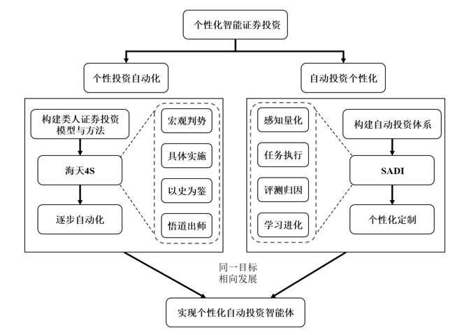

# 第一章
## 定义以及要点
提高人理性投资效率的学问
要点：理性投资，自动化提高效率，个性化
 <!--more--> 
## 个性投资自动化
从人的角度出发，研究个人理性投资逐步向自动化发展
1.归纳出人的**理性投资的科学方法**
2.自顶向下逐步分解细化为多个人工任务
3.开发自动系统代替人工任务
**宏观判势，具体实施，以史为鉴，悟道出师**
## 自动投资人性化
从自动系统的角度，研究自动化由易到难逐步发展适应不同的人的理性选择
1.将人的需求由易到难构建自动投资层次体系
2.建立自动投资智能体
3.逐步完善理性智能投资系统供不同的用户理性使用
理性智能投资系统：SADI-5L-MT
一。自动证券投资的层次结构ASI5L
信息量化--个性归纳--自动投资推荐--受控自动投资--完全自动投资
二。自动投资智能体结构SADI
感知量化--任务执行--评测归因--学习进化

