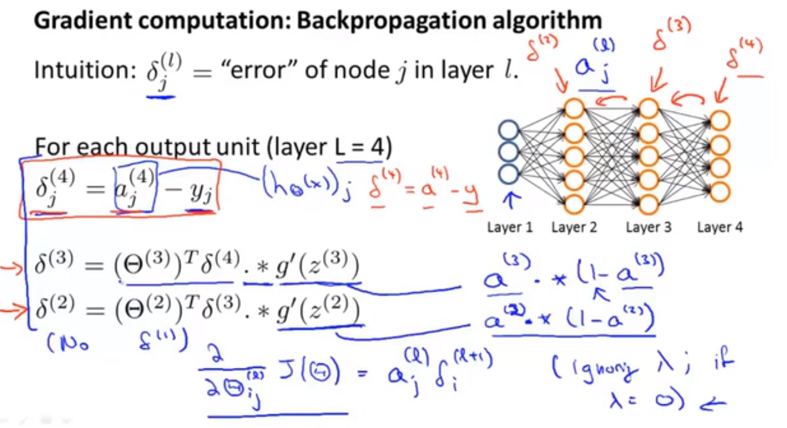

# 监督与非监督学习
ovtave matlab
## 线性回归问题
## 递归下降
## 线性回归的递归下降
# 多功能
## 多元梯度下降法
 <!--more--> 

## 多元递归下降法之特征缩放
尽量把特征值缩放在-1到1之间。
均值归一化，xi-ui使得平均数为0，然后再进行特征缩放在-1到1
## 多元梯度下降法之学习率α
选择适当的学习率，一般是0.001，然后翻三倍或者翻十倍的方法进行取值的方式
太大容易错过最低点，太小递归速度太慢
## 特征与多项式回归
## 正规方程

# 逻辑回归
分类算法  sigmoid函数
## 决策界限
进行分类的那个界限
## 代价函数
简化代价函数与梯度下降

## 高级优化
## 多元分类，一对多
将其他的类型设置为负类，得到训练集，然后输入一个x，去进行预测的时候，计算出每个预测结果，最大的那个数值就是x属于的类别
# 过拟合问题
1.减少选取变量的数量，找到重要的变量不重2要的舍去--模型选择方法
2.正则化，将保留所有变量，但是要减少量级。
## 正则化--代价函数
参数值小意味着得到一个更加简单的假设模型。
λ表示惩罚项，惩罚项越大表示被惩罚的那个θ的值应该越小

## 线性回归的正则化
梯度下降法的正则化
 
 正规方程的正则化
 
## 逻辑回归的正则化
梯度下降算法的正则化和线性回归当中的递归下降正则化很像

高级优化算法的正则化

# 非线性假设
## 神经网络

# 神经网络的代价函数
n表示有多少个影响因素，m表示在逻辑回归中可以分为多少个类，sl表示在每一层的元素的个数，从输入层到隐藏层到输出层，θ其实是一个向量矩阵

## 反向传播算法

第一步随机初始化权重值，第二步用向前传播的方法计算出hθ(x^i)，第三步用代码计算出代价函数，第四步用反向传播的方法计算偏导数，第五步使用梯度检查，比较反向传播得到的偏导数和用数值方法得到的估计值，然后停止梯度检查，最后一步使用梯度下降或者一些高级优化算法最小化代价函数
## 模型选择，训练、验证和测试集
用交叉验证集来进行测试，获取合适的degree
## 偏差和方差
高偏差：训练误差和验证误差都很大（欠拟合)
高方差：训练误差很大验证误差不大（过拟合）

## 正则化和方差偏差
λ如果非常大表示的是欠拟合，λ如果非常小表示的是过拟合

## 学习曲线

高方差：采用使用更多的训练集，使用更少的特征，增加λ，欠拟合，每个特征趋近与0
高偏差（容易走偏）：采用更多的特征，减少λ，过拟合，每个特征趋近自己的值
# 决定执行的优先级
## 误差分析
## 不对称分类的误差评估
## 精准度和召回率的权衡
精度 = 真正例/（真正例+假正例）：在所有判为恐怖分子中，真正的恐怖分子的比例
召回率= 真正例/（真正例+假反例）：正确判为恐怖分子占实际所有的恐怖分子的比例
像癌症这种情况，我们希望不漏掉任何一个可能出现的患者，所有召回率比较高
## 机器学习数据
# 支持向量机
## 优化目标
从逻辑回归当中进行改进得到的，支持向量机也叫做大间隔分类器

## 大间隔分类器的数学原理

## 硬间隔对偶关系
 
 
## 核函数
 
# 聚类算法
k-means算法：随机初始化，k太大的话多次随机初始化的效果就不太好
## 选取聚类数量
# 数据压缩（降维）
## 可视化
## 主成分分析问题
pca 选择k值
 
