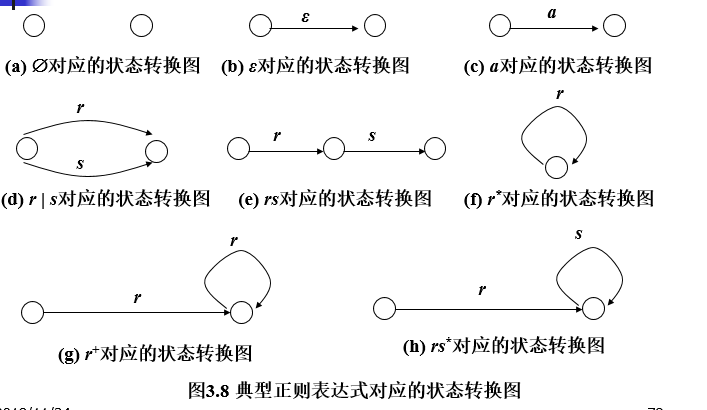
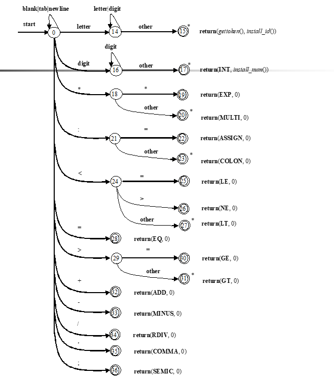
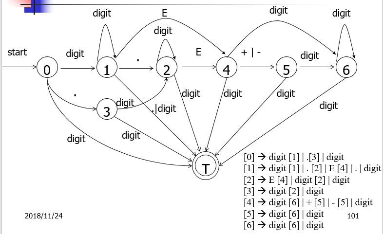
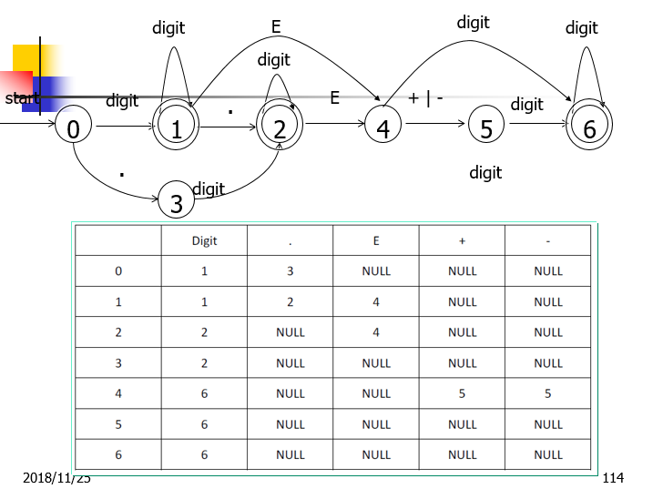
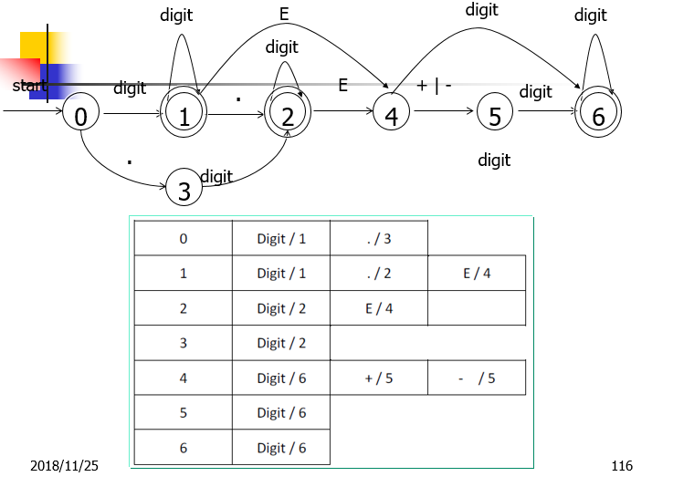

# 词法分析器的功能
词法分析器读入表示源程序的字符流，按照程序功能等价的要求，将其转换成对应的单词序列，并剔除其中的空格、注解等不影响程序的字符
 <!--more--> 
## 单词的分类和表示
单词是程序语言中具有独立意义的最小语法单位
&emsp;&emsp;（1）关键字：也叫基本字，多用来作为语句的标识
&emsp;&emsp;（2）标识符：用来表示各种名字，如变量名、过程名和数组名
&emsp;&emsp;（3）常数：分为整常数、实常数和字符串常数
&emsp;&emsp;（4）运算符：又可以分为算术运算符（+-=）；逻辑运算符（not or and）；以及关系运算符（<> >= <=）
&emsp;&emsp;（5）分界符：又叫界限符（,;()）
把单词表示成**二元组**：（种别，属性值）
## 源程序的输入缓冲和预处理
1.超前搜索和回退
&emsp;&emsp;例如对单词<>，>=
2.缓冲区
&emsp;&emsp;1）双缓冲区
&emsp;&emsp;**开始指针**：指向当前识别单词的第一个字符
&emsp;&emsp;**向前指针**：指向当前读入的字符
&emsp;&emsp;2）带标记的缓冲区
&emsp;&emsp;在缓冲区两部分的结尾处各设置了一个“标志”，每次移动向前指针只要测试是否遇到了**eof**，如果是，则判断是否为缓冲区某半部分的末尾，不是则不进行进一步的测试
3.空白字符的剔除
&emsp;&emsp;放在输入串被放在缓冲区之前完成，进行适当的**预处理**
## 词法分析阶段的错误处理
错误通常包括以下几种
(1)非法字符：@
(2)单词拼写错误：began
(3)注解或字符常数不封闭：/*...
(4)变量重复
对错误的处理：
1.检查
2.错误恢复和续编译
&emsp;最简单的错误恢复策略为**紧急方式恢复**

# 单词的描述
## 正则文法
正则文法描述的是**T**上的正则语言
## 正则表达式
正则式，正规式
正则表达式所表示的语言称为**正则集**
## 正则表达式与正则文法的等价性
1.为正则文法的每个产生式构造一个**正则表达式方程式**
方程式构造规则
2.解联立方程组，求等价的正则表达式r
代入消元规则
***正则定义式***
对于任意在字母表上的正则表达式r，形如A->r的式子
## 有穷状态自动机
有穷状态控制器：从输入带上读入字符，每读一个字符，读头就指向下一个待读入的字符
有穷状态自动机是一个五元组：状态的非空有穷集合；状态转移函数；开始状态；终止状态；接收状态
## 正则表达式转换成状态转换图

# 单词的识别
如何利用有穷状态自动机来进行单词的识别
## 有穷状态自动机和单词识别的关系
一个字符一个字符的逐步识别，看成有限个状态的变换
## 单词识别的状态转换图表示

## 几种典型的单词识别问题
主要是超前搜索和回退。回退一般用栈来实现
## 状态转换图的实现
单词的**识别规则库**
实现方式
访问速度快但是浪费空间多

访问速度慢但是节省空间 

